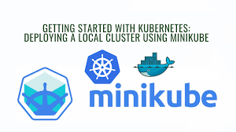
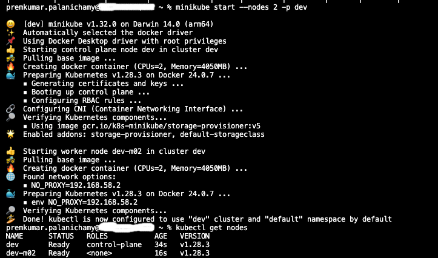
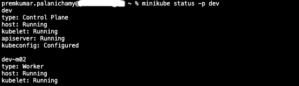
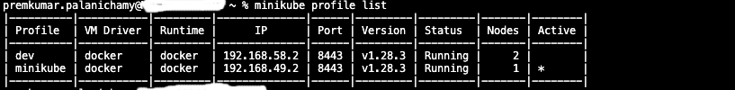
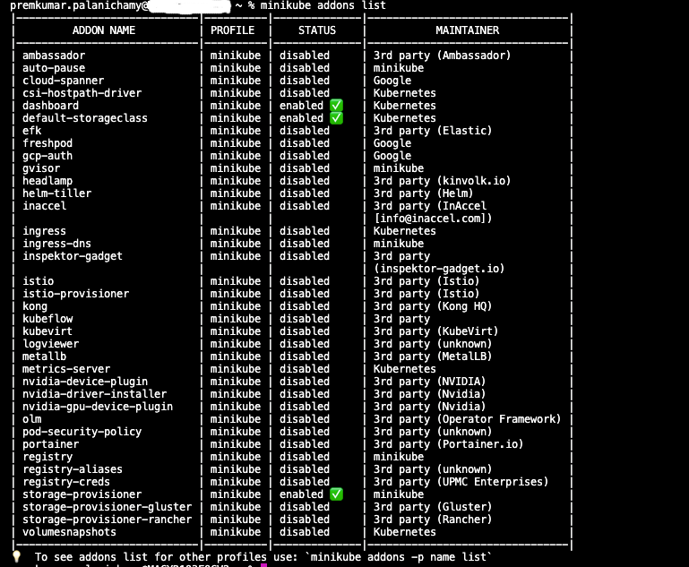
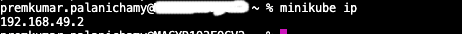

# learn-k8s-minikube
Master Minikube with essential commands and tips in this comprehensive guide, enabling seamless Kubernetes development on your local machine.


# Getting Started with Minikube: 

This tutorial will help you to setup Kubernetes on Your Local Machine.

__*Kubernetes*__ has become the de facto standard for container orchestration, allowing developers to deploy, scale, and manage containerized applications. 

__*Minikube*__ is a powerful tool that enables you to run a Kubernetes cluster locally on your machine, making it easy to develop and test applications in a Kubernetes environment. 

In this article, we'll explore what Minikube is, how to set it up, and some important commands to get you started.

## What is Minikube?
Minikube is an open-source tool that facilitates the setup of a single/multi-node Kubernetes cluster on your local machine. It's designed for developers who want to experience Kubernetes without the need for a full-scale, multi-node cluster. Minikube allows you to develop and test Kubernetes applications in an environment that closely mirrors a production cluster.

<p align="center">
  
</p>


## Minikube vs. Kubernetes: Understanding the Differences

Minikube and Kubernetes are not opposing entities; in fact, Minikube is a lightweight version of Kubernetes designed for local development and testing. However, there are notable distinctions between Minikube and more comprehensive Kubernetes distributions. Let's examine these variances in a comparative chart:

| Feature                           | Minikube                                  | Most Other Kubernetes Distros                    |
|-----------------------------------|------------------------------------------|--------------------------------------------------|
| **Supported Operating Systems**    | Linux, Windows, macOS                     | Linux (Windows can host worker nodes)           |
| **Cluster Size by Default**        | Single-node                              | Multi-node                                       |
| **Deployment in the Cloud**        | Not recommended (theoretically possible) | Yes                                              |
| **Managed Service Availability**  | No                                       | Yes (for many distributions)                      |
| **Storage Handling**               | Local directories inside Minikube        | Container Storage Interface (CSI) in most cases  |


## Installation
Before diving into Minikube, make sure you have the following prerequisites installed on your machine:

#### Prerequisites for Minikube

Ensure a smooth installation and operation of Minikube by meeting the following requirements:

- CPU: A minimum of 2 CPUs is required.
- Memory: Allocate at least 2GB of free memory.
- Disk Space: Ensure you have a minimum of 20GB of free disk space.
- Internet Connection: Maintain a stable and reliable Internet connection for seamless functionality.
- Container or VM Manager: Install a suitable container or virtual machine manager before initiating the Minikube installation. Options include Docker, Hyperkit, Hyper-V, KVM, Parallels, Podman, VirtualBox, or VMWare. Prioritize the installation of one of these tools to facilitate a smooth Minikube experience.

> Note: I would suggest to go with Docker and for installing you could effectively use either VMware workstation or VirtualBox or if you have free cloud subscription spin up simple VM or you can use like me on your workstation if you have good configuration. In my case, I have installed and using it on MacOS

Once you have the prerequisites installed, you can install Minikube. 

The installation steps vary depending on your operating system, so refer to the official documentation for detailed instructions.

### Installing Minikube on Linux

On most Linux systems, you can effortlessly install Minikube using the following commands:

```bash
curl -LO https://storage.googleapis.com/minikube/releases/latest/minikube-linux-amd64

sudo install minikube-linux-amd64 /usr/local/bin/minikube
```

Additionally, many major Linux distributions provide RPM or Debian packages for a straightforward Minikube installation.

### Installing Minikube on Windows
For Windows users, the simplest method to install Minikube is by downloading and running the installer. Alternatively, you can employ PowerShell to set it up by following these steps:

```powershell
New-Item -Path 'c:\' -Name 'minikube' -ItemType Directory -Force

Invoke-WebRequest -OutFile 'c:\minikube\minikube.exe' -Uri 'https://github.com/kubernetes/minikube/releases/latest/download/minikube-windows-amd64.exe' -UseBasicParsing
```

### Installing Minikube on macOS
On macOS, installing Minikube is a breeze with the following commands:

```bash
curl -LO https://storage.googleapis.com/minikube/releases/latest/minikube-darwin-amd64

sudo install minikube-darwin-amd64 /usr/local/bin/minikube
```

For macOS users who prefer Homebrew, an alternative installation method is available:

> Note: in my case, I have installed minikube using brew

```bash
brew install minikube
```

Now, you have multiple options to install Minikube based on your operating system and personal preferences. Choose the method that best suits your needs and get started with Kubernetes on your local machine.

Post installation you can verify it by running

```bash
minikube version
```

### Basic Minikube Commands
1. Starting Minikube
To start Minikube, use the following command:

```bash
minikube start
```

This command will create a single-node Kubernetes cluster with default settings.

_Driver Selection:_

If you use the Docker driver,

```bash
minikube start -p dev --container-runtime=docker --vm=true
```

Here, we explicitly specify --driver=docker because, by default, Minikube may choose the Docker driver if Docker is installed on your system. If Docker is not present and if you want to choose any other driver that is also possible.

<p align="center">
  
</p>

_Specific Kubernetes Version_
If you want to install a specific Kubernetes version, you can use the --kubernetes-version flag. For example:

```bash
minikube start --kubernetes-version=1.28.0 --driver=docker
```

These guidelines help tailor your Minikube setup based on your preferred driver, runtime environment, and Kubernetes version.

If you want to start minikube as multi node,
```bash
minikube start --nodes 2 -p dev
```

2. Stopping Minikube
When you're done working with Minikube, you can stop the cluster with:

```bash
minikube stop
```

In case, if you have created a profile then mention the profile name accordingly.

```bash
minikube stop -p dev
```

3. Checking Minikube Status
To check the status of your Minikube cluster, use:

```bash
minikube status
```

<p align="center">
  
</p>

In case, if you have created a profile then mention the profile name accordingly.

```bash
minikube status -p dev
```

This command provides information about whether the cluster is running.

4. Accessing the Kubernetes Dashboard
Minikube comes with a web-based Kubernetes dashboard. You can access it with:

```bash
minikube dashboard
```

This opens the dashboard in your default web browser.

If you want only the url to be printed,

```bash
minikube dashboard --url
```

5. Deleting Minikube
When you no longer need the Minikube cluster, you can delete it with:

```bash
minikube delete
```
This removes the entire cluster and its associated resources.

In case, if you have created a profile then mention the profile name accordingly.

```bash
minikube delete -p dev
```

### Advanced Minikube Commands

1. Using a Specific Kubernetes Version

You can specify a Kubernetes version when starting Minikube:

```bash
minikube start --kubernetes-version=v1.21.0
```

2. Configuring CPU and Memory

Adjust the CPU and memory allocated to the Minikube VM:

```bash
minikube start --cpus=2 --memory=4096
```

3. Switching Between Minikube Profiles

If you have multiple Minikube profiles, you can switch between them:

```bash
minikube profile list          # List available profiles
minikube profile set <profile> # Switch to a specific profile
```

<p align="center">
  
</p>

4. Listing Add-ons

Minikube supports various add-ons, which you can list using below command,

```bash
minikube addons list
```

<p align="center">
  
</p>

5. Enabling Add-ons

Minikube supports various add-ons. To enable an add-on, use:

```bash
minikube addons enable <addon-name>
```

Replace <addon-name> with the name of the desired add-on.


6. Retrieving Minikube IP
To get the IP address of your Minikube cluster, use:

```bash
minikube ip
```

<p align="center">
  
</p>

## This is useful for accessing services deployed in your cluster.

### Accessing Minikube Nodes via SSH

- When you need to inspect Kubernetes configurations or troubleshoot, you can SSH into the Minikube node using the following command:

```bash
minikube ssh
```

> To edit files within the node, use the sudo command.

- If your Minikube setup involves multiple nodes, you can SSH into a specific node. Begin by listing the available nodes using kubectl:

```bash
kubectl get nodes
```

- Identify the desired node and SSH into it with the following command, replacing "dev-m02" with the appropriate node name:

```bash
minikube ssh -n dev-m02
```

This process allows you to gain direct access to the Minikube nodes, facilitating detailed inspection and troubleshooting as needed.

- List All Services:

To view all available services and their endpoints, use

```bash
minikube service list
```

To Retrieve the URL for a specific service by executing:

```bash
minikube service --url <service-name>
```

> Replace <service-name> with the actual name of the service.

- Enabling Feature Gates in Minikube

To explore alpha and beta features introduced in new Kubernetes versions, Minikube provides a feature gates option.

For instance, let's consider the NodeSwap feature gate. To enable it during Minikube installation, utilize the following command:

```bash
minikube start -p dev --kubernetes-version=v1.28.0 --feature-gates=NodeSwap=true
```

Replace v1.28.0 with your desired Kubernetes version. This command activates the NodeSwap feature gate, allowing you to experiment with the associated functionalities.

### Conclusion

Minikube is an invaluable tool for Kubernetes development and testing. Whether you're a beginner exploring Kubernetes or an experienced developer working on a local environment, Minikube simplifies the process of setting up and managing Kubernetes clusters on your machine. The commands highlighted in this article should serve as a solid foundation for your Minikube journey. As you delve deeper into Kubernetes development, continue exploring the extensive features and capabilities that Minikube offers to enhance your local Kubernetes experience.

## License

This project is licensed under the [Apache License 2.0](https://www.apache.org/licenses/LICENSE-2.0) - see the LICENSE file for details.

Please replace `https://github.com/devopshubproject/learn-k8s-minikube` with the URL of your Git repository if you have one. This README provides a comprehensive guide to your Git Mirroring concept and can be extended or modified as needed.


## <font color = "red"> Follow-Me </font>

[](https://github.com/premkumar-palanichamy)

<p align="left">
<a href="https://linkedin.com/in/premkumarpalanichamy" target="blank"></a>
</p>

[](https://www.youtube.com/channel/UCJKEn6HeAxRNirDMBwFfi3w)
